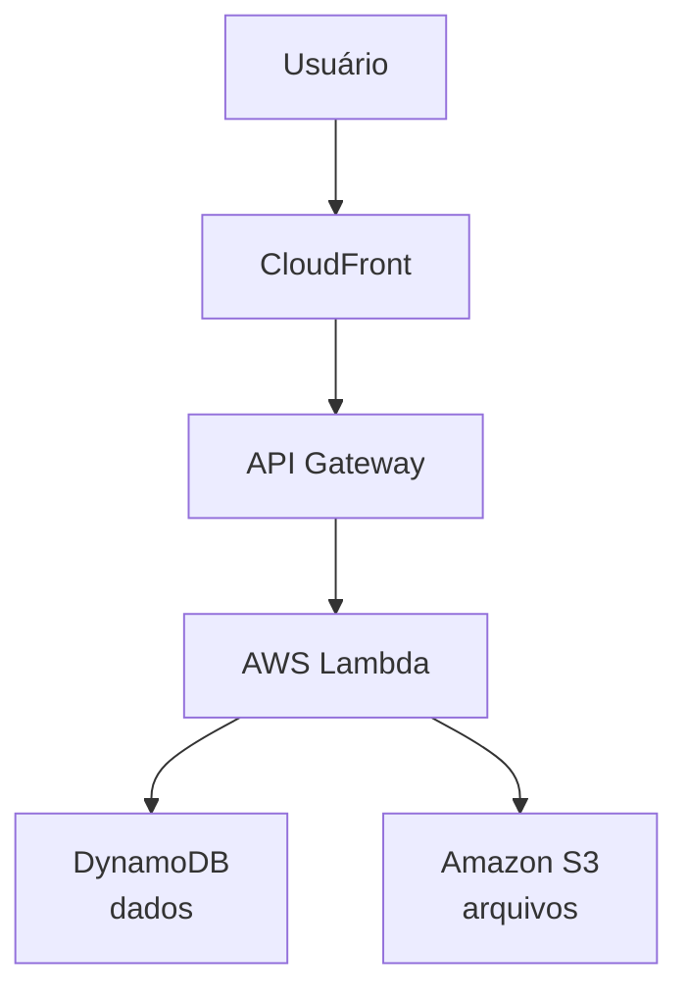

    

A **Amazon Web Services (AWS)** é a plataforma de computação em nuvem da Amazon. Ela oferece centenas de serviços para que empresas e desenvolvedores possam criar, hospedar e gerenciar aplicações sem precisar manter uma infraestrutura física própria.

## O que é computação em nuvem?

Computação em nuvem é o fornecimento de recursos de TI pela internet, como servidores, armazenamento, bancos de dados e redes. Em vez de comprar e manter equipamentos, você utiliza os recursos sob demanda e paga apenas pelo que consome.

## Principais serviços da AWS

* [Amazon Athena](./docs/Athena.md): Serviço de consulta de dados(query)
* [Amazon EC2](./docs/ec2.md): cria e gerencia servidores virtuais.
* [Amazon S3](./docs/s3.md): armazena arquivos, imagens, vídeos e backups.
* [Amazon RDS](./docs/rds.md): banco de dados relacional gerenciado.
* [Amazon DynamoDB](./docs/DynamoDB.md): banco de dados NoSQL de alta disponibilidade.
* [AWS Lambda](./docs/Lambda.md): executa código sem gerenciar servidores.
* [Amazon VPC](./docs/VPC.md): cria redes virtuais isoladas.
* [Amazon CloudWatch](./docs/CloudWatch.md): monitora aplicações e infraestrutura.
* [AWS IAM](./docs/IAM.md): controla usuários, permissões e acessos.
* [Amazon CloudFront](./docs/CloudFront.md): distribui conteúdo com baixa latência.
* [Amazon API Gateway](./docs/gateway.md): cria e gerencia APIs.

## Modelos de serviço

A AWS oferece diferentes modelos de computação em nuvem:

* **IaaS (Infrastructure as a Service):** fornece infraestrutura, como servidores, armazenamento e redes. Exemplo: Amazon EC2.
* **PaaS (Platform as a Service):** oferece uma plataforma para desenvolver e implantar aplicações sem gerenciar a infraestrutura. Exemplo: AWS Elastic Beanstalk.
* **Serverless:** permite executar aplicações sem administrar servidores. Exemplo: AWS Lambda.

## Vantagens da AWS

* Escalabilidade automática para acompanhar a demanda.
* Alta disponibilidade e tolerância a falhas.
* Segurança com criptografia e controle de acesso.
* Modelo de pagamento conforme o uso.
* Presença global com data centers em diversas regiões.

## Exemplos de uso

Empresas utilizam a AWS para:

* Hospedar sites e aplicações web.
* Desenvolver aplicativos para dispositivos móveis.
* Armazenar e analisar grandes volumes de dados.
* Executar soluções de inteligência artificial e aprendizado de máquina.
* Realizar backups e recuperação de desastres.
* Implementar arquiteturas de microsserviços e aplicações serverless.

## Exemplo de arquitetura simples

## Resumo

A AWS é uma das principais plataformas de computação em nuvem do mundo, oferecendo serviços para infraestrutura, armazenamento, bancos de dados, redes, segurança, monitoramento e desenvolvimento de aplicações. Seu principal diferencial é permitir que organizações utilizem recursos de TI de forma escalável, segura e com pagamento baseado no consumo, reduzindo a necessidade de investir em infraestrutura própria.

