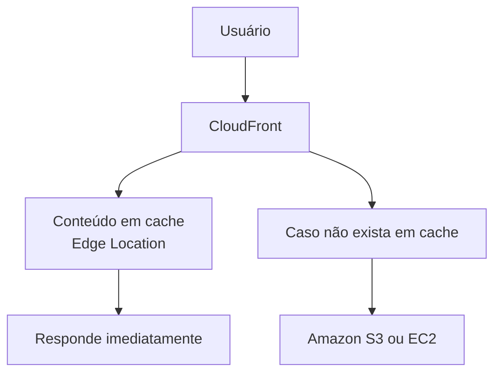
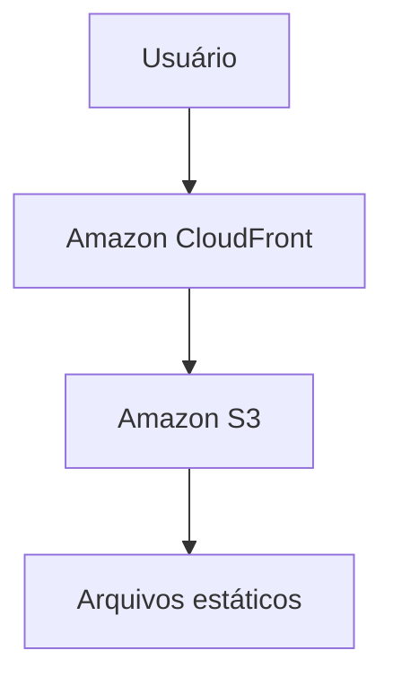
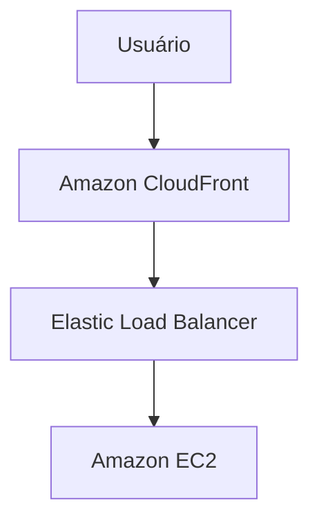

# CloudFront

O **Amazon CloudFront** é o serviço de **CDN (Content Delivery Network)** da AWS. Ele acelera a entrega de conteúdo para usuários ao armazenar cópias de arquivos em servidores distribuídos ao redor do mundo, chamados de **Edge Locations**.

Quando um usuário solicita um conteúdo, como uma imagem, vídeo, arquivo ou página web, o CloudFront entrega esse conteúdo a partir do servidor mais próximo, reduzindo a latência e melhorando o desempenho da aplicação.

## Como funciona

O CloudFront atua como intermediário entre os usuários e a origem do conteúdo (Origin).

Fluxo simplificado:

Se o conteúdo já estiver armazenado em cache na Edge Location, ele é entregue imediatamente. Caso contrário, o CloudFront busca o conteúdo na origem, o armazena em cache e o entrega ao usuário.

## Principais componentes

### 1. Distribuição (Distribution)

É a configuração do CloudFront que define:

* A origem do conteúdo.
* As regras de cache.
* As configurações de segurança.
* O domínio utilizado para acesso.

### 2. Origem (Origin)

É o local onde o conteúdo original está armazenado.

As origens mais comuns são:

* Amazon S3
* Amazon EC2
* Elastic Load Balancing
* Servidores externos (on-premises)

### 3. Edge Locations

São servidores distribuídos globalmente que armazenam cópias temporárias (cache) do conteúdo para reduzir o tempo de resposta aos usuários.

### 4. Cache

O CloudFront mantém cópias dos arquivos nas Edge Locations por um período configurável (TTL – Time to Live).

Isso reduz:

* Número de acessos ao servidor de origem.
* Tempo de carregamento.
* Consumo de largura de banda.

## Principais características

* Distribuição global de conteúdo.
* Cache inteligente.
* Baixa latência.
* Alta disponibilidade.
* Integração com diversos serviços da AWS.
* Suporte a HTTPS e criptografia.

## Recursos de segurança

O CloudFront oferece diversos recursos para proteger aplicações e conteúdos:

* Criptografia com HTTPS.
* Integração com o AWS Certificate Manager.
* Controle de acesso a conteúdos privados.
* Integração com o AWS WAF para proteção contra ataques a aplicações web.
* Suporte a URLs e cookies assinados para restringir o acesso a conteúdos.

## Casos de uso

O Amazon CloudFront é utilizado para:

* Hospedagem de sites estáticos.
* Distribuição de imagens e vídeos.
* Streaming de conteúdo.
* APIs com baixa latência.
* Download de arquivos.
* Aplicações web globais.

## Exemplo de arquitetura

## Outro exemplo:

Nesse cenário, o CloudFront distribui o conteúdo da aplicação armazenado no Amazon S3 ou servido por instâncias EC2, reduzindo a latência e melhorando a experiência dos usuários.

## Vantagens

* Redução do tempo de carregamento das aplicações.
* Menor consumo de recursos da origem.
* Distribuição global de conteúdo.
* Integração com diversos serviços da AWS.
* Recursos avançados de segurança.
* Escalabilidade automática.

## Desvantagens

* Configuração de cache inadequada pode resultar na entrega de conteúdo desatualizado.
* Há custos relacionados ao tráfego de dados e às requisições.
* Em aplicações pequenas ou acessadas apenas localmente, os benefícios podem ser menos significativos.

## Resumo

O **Amazon CloudFront** é o serviço de CDN da AWS responsável por distribuir conteúdo de forma rápida e segura para usuários em todo o mundo. Utilizando uma rede global de Edge Locations, ele reduz a latência, melhora o desempenho das aplicações e diminui a carga sobre os servidores de origem. É amplamente utilizado para acelerar sites, APIs, aplicações web e a entrega de arquivos estáticos e conteúdo multimídia.
