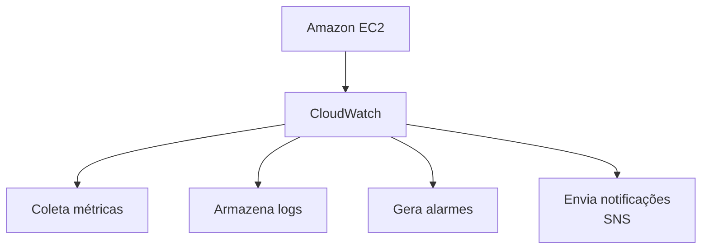
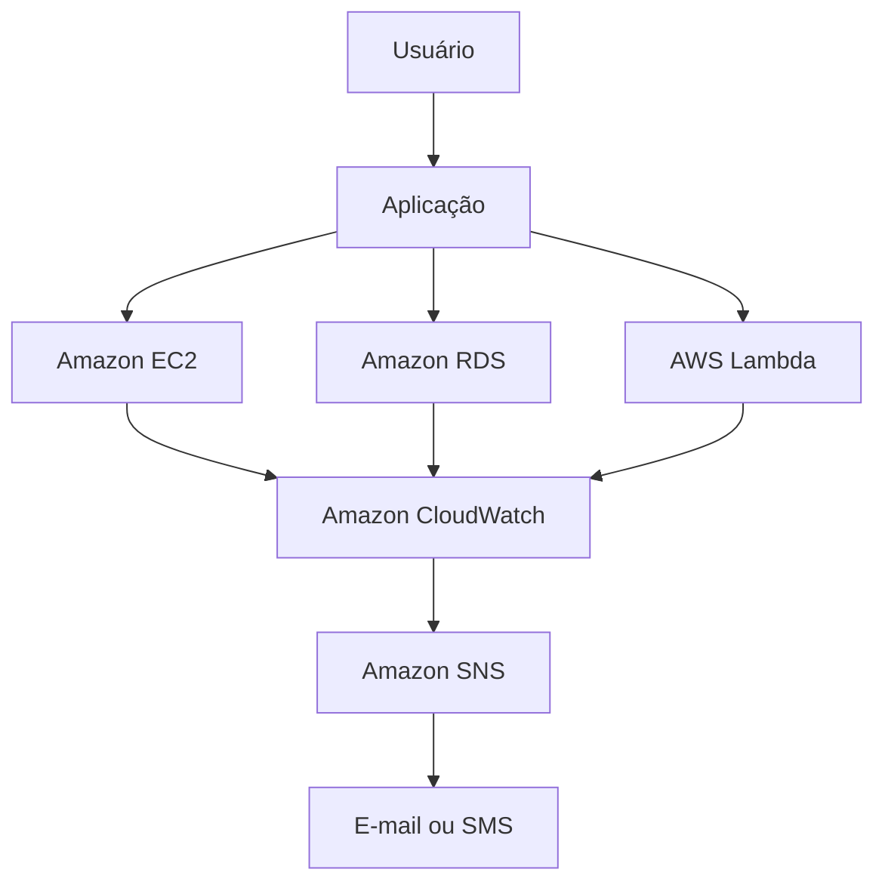

# CloudWatch

O **Amazon CloudWatch** é um serviço de monitoramento e observabilidade da AWS que permite acompanhar o desempenho, a disponibilidade e a integridade de recursos e aplicações na nuvem. Ele coleta métricas, logs e eventos, ajudando a identificar problemas, gerar alertas e automatizar respostas a incidentes.

O CloudWatch é amplamente utilizado para monitorar serviços como **Amazon EC2**, **AWS Lambda**, **Amazon RDS**, **Amazon DynamoDB** e diversos outros serviços da AWS.

## Como funciona

O Amazon CloudWatch coleta informações dos recursos da AWS e as apresenta por meio de métricas, logs e painéis (dashboards). Com base nesses dados, é possível configurar alarmes para notificar administradores ou executar ações automáticas quando determinadas condições forem atendidas.

Exemplo de fluxo:

## Principais funcionalidades

### 1. Métricas (Metrics)

As métricas representam informações sobre o desempenho dos recursos.

Exemplos:

* Utilização de CPU
* Uso de memória (com agente instalado)
* Tráfego de rede
* Espaço em disco
* Número de requisições
* Latência

### 2. Logs (CloudWatch Logs)

Permite armazenar e consultar logs de aplicações e serviços.

Exemplos:

* Logs de aplicações
* Logs do AWS Lambda
* Logs do Amazon EC2
* Logs do Amazon API Gateway

### 3. Alarmes (CloudWatch Alarms)

Monitoram métricas e executam ações automaticamente quando um limite é atingido.

Exemplo:

* CPU acima de 80% durante 5 minutos.
* Enviar notificação.
* Acionar uma política de escalabilidade automática.

### 4. Dashboards

Permitem criar painéis personalizados para visualizar informações importantes em tempo real.

Um dashboard pode exibir:

* CPU das instâncias
* Utilização do banco de dados
* Número de requisições
* Tempo de resposta da aplicação
* Erros registrados

### 5. Eventos

O CloudWatch pode detectar eventos e executar ações automáticas em conjunto com serviços como o Amazon EventBridge.

## Casos de uso

O Amazon CloudWatch é utilizado para:

* Monitorar servidores.
* Monitorar bancos de dados.
* Acompanhar funções Lambda.
* Detectar falhas em aplicações.
* Criar dashboards operacionais.
* Configurar alertas automáticos.
* Apoiar processos de auditoria e análise de desempenho.

## Exemplo de arquitetura

Nesse exemplo, o CloudWatch monitora os recursos da aplicação. Se um problema for detectado, um alarme envia uma notificação por meio do **Amazon SNS**.

## Vantagens

* Monitoramento centralizado dos serviços da AWS.
* Coleta automática de métricas.
* Criação de dashboards personalizados.
* Alertas automáticos em tempo real.
* Integração com diversos serviços da AWS.
* Auxilia na identificação e resolução de problemas.

## Desvantagens

* Algumas métricas detalhadas exigem configuração adicional ou instalação de agentes.
* O armazenamento de grandes volumes de logs pode aumentar os custos.
* Dashboards e alarmes complexos podem exigir planejamento para evitar excesso de notificações.

## Resumo

O **Amazon CloudWatch** é o principal serviço de monitoramento e observabilidade da AWS. Ele permite coletar métricas, armazenar logs, criar painéis e configurar alarmes para acompanhar o desempenho de aplicações e infraestrutura. Com isso, as equipes conseguem identificar falhas rapidamente, automatizar respostas a incidentes e manter aplicações mais confiáveis e disponíveis.
