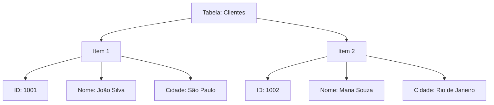
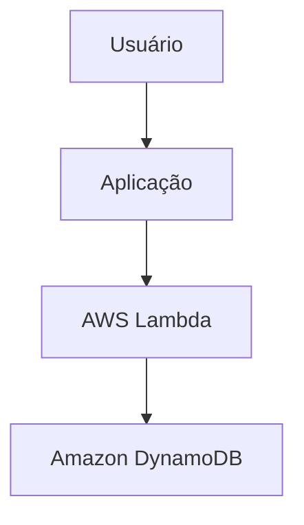

# DynamoDB

O **Amazon DynamoDB** é um serviço de banco de dados **NoSQL** totalmente gerenciado da AWS. Ele foi projetado para oferecer **alta performance, baixa latência e escalabilidade automática**, sendo ideal para aplicações que precisam processar grandes volumes de dados e um alto número de requisições.

Diferentemente dos bancos de dados relacionais, o DynamoDB não utiliza tabelas com relacionamentos complexos. Em vez disso, armazena dados de forma flexível em tabelas compostas por itens e atributos.

## Como funciona

No DynamoDB, os dados são organizados da seguinte forma:

* **Tabela:** estrutura que armazena os dados.
* **Item:** corresponde a um registro da tabela.
* **Atributo:** representa uma informação do item, semelhante a uma coluna em bancos relacionais.

Exemplo:

Cada item pode possuir atributos diferentes, oferecendo maior flexibilidade para armazenar informações.

## Principais características

* **Escalabilidade automática:** aumenta ou reduz a capacidade conforme a demanda.
* **Baixa latência:** consultas normalmente respondem em poucos milissegundos.
* **Alta disponibilidade:** os dados são replicados automaticamente em várias zonas de disponibilidade.
* **Serviço totalmente gerenciado:** a AWS administra a infraestrutura, atualizações e manutenção.
* **Segurança:** integração com o AWS IAM, criptografia de dados e controle de acesso.

## Componentes importantes

* **Partition Key:** chave que identifica e distribui os dados entre as partições.
* **Sort Key (opcional):** permite organizar e consultar itens relacionados dentro da mesma chave de partição.
* **Índices Secundários (GSI e LSI):** possibilitam consultas utilizando atributos diferentes da chave principal.
* **Streams:** registram alterações nos dados e permitem integração com outros serviços, como o AWS Lambda.

## Casos de uso

O Amazon DynamoDB é indicado para aplicações que exigem alta escalabilidade, como:

* Aplicações web e móveis.
* Jogos online.
* Plataformas de comércio eletrônico.
* Sistemas de Internet das Coisas (IoT).
* Catálogos de produtos.
* Sessões de usuários e autenticação.
* Sistemas de recomendação e personalização.

## Exemplo de arquitetura

Nesse exemplo, uma função Lambda recebe a requisição da aplicação e grava ou consulta os dados no DynamoDB.

## Vantagens

* Alta escalabilidade automática.
* Desempenho consistente, mesmo com milhões de requisições.
* Baixa necessidade de administração.
* Integração com diversos serviços da AWS.
* Modelo de pagamento baseado no consumo ou em capacidade provisionada.

## Desvantagens

* Não é ideal para consultas relacionais complexas (JOINs).
* A modelagem dos dados deve ser planejada com base nos padrões de acesso da aplicação.
* Mudanças no modelo de dados podem exigir ajustes na aplicação.

## Resumo

O **Amazon DynamoDB** é um banco de dados NoSQL totalmente gerenciado, desenvolvido para aplicações que necessitam de **alta disponibilidade, desempenho consistente e escalabilidade automática**. Ele é amplamente utilizado em sistemas modernos, especialmente em arquiteturas **serverless** e de **microsserviços**, oferecendo uma solução eficiente para armazenar grandes volumes de dados com baixa latência e mínima administração.

