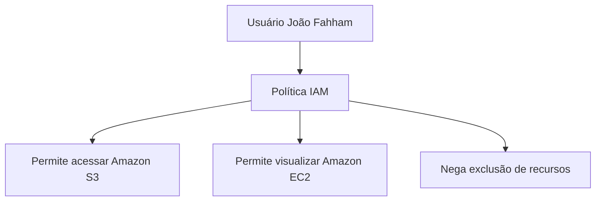
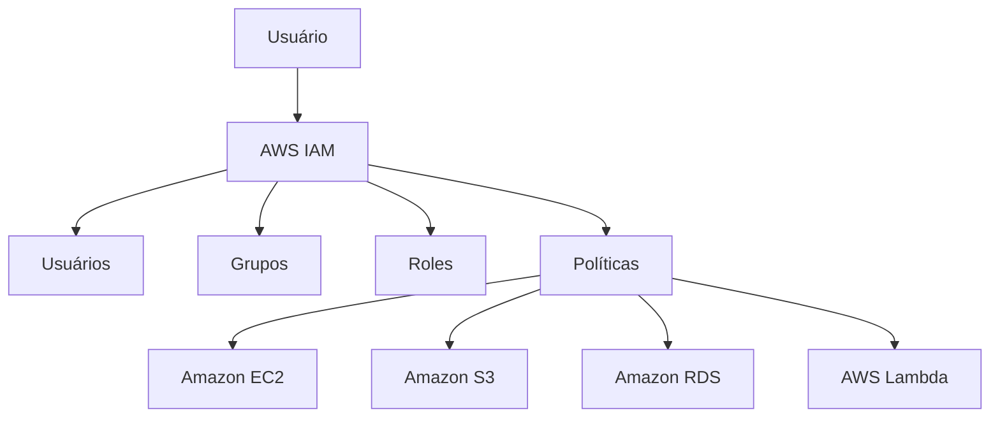

# IAM

O **AWS IAM (Identity and Access Management)** é o serviço da AWS responsável pelo gerenciamento de identidades e controle de acesso aos recursos da nuvem. Com o IAM, é possível definir **quem pode acessar quais recursos e quais ações cada usuário ou serviço está autorizado a executar**.

O objetivo do IAM é aumentar a segurança da infraestrutura, garantindo que cada usuário ou aplicação tenha apenas as permissões necessárias para realizar suas atividades.

## Como funciona

O IAM utiliza políticas de permissões para controlar o acesso aos serviços da AWS. Essas políticas podem ser associadas a usuários, grupos ou funções (roles).

Exemplo:




Nesse exemplo, o usuário pode acessar arquivos armazenados no **Amazon S3** e visualizar instâncias do **Amazon EC2**, mas não pode excluí-las.

## Principais componentes

### 1. Usuários (Users)

Representam pessoas ou aplicações que precisam acessar a conta AWS.

Cada usuário pode possuir:

* Nome de usuário.
* Senha para acesso ao console.
* Chaves de acesso (Access Key e Secret Access Key) para uso via API ou CLI.

### 2. Grupos (Groups)

Permitem organizar usuários com permissões semelhantes.

Exemplo:

* Grupo Desenvolvedores
* Grupo Administradores
* Grupo Analistas

As permissões são atribuídas ao grupo, facilitando a administração dos acessos.

### 3. Funções (Roles)

As **Roles** fornecem permissões temporárias para usuários, aplicações ou serviços da AWS.

Exemplos:

* Uma função Lambda acessando um bucket do Amazon S3.
* Uma instância do Amazon EC2 acessando uma tabela do Amazon DynamoDB.

As Roles são consideradas uma prática mais segura do que armazenar credenciais diretamente nas aplicações.

### 4. Políticas (Policies)

São documentos em formato JSON que definem quais ações são permitidas ou negadas.

Exemplo simplificado:

```json
{
  "Effect": "Allow",
  "Action": "s3:GetObject",
  "Resource": "*"
}
```

Essa política permite a leitura de objetos no Amazon S3.

## Princípio do menor privilégio

Uma das principais recomendações de segurança da AWS é seguir o **Princípio do Menor Privilégio (Least Privilege)**.

Isso significa conceder apenas as permissões estritamente necessárias para que um usuário ou aplicação execute suas tarefas, reduzindo os riscos em caso de uso indevido ou comprometimento de credenciais.

## Autenticação multifator (MFA)

O IAM permite habilitar **MFA (Multi-Factor Authentication)**, adicionando uma camada extra de segurança.

Além da senha, o usuário deve informar um código temporário gerado por um aplicativo autenticador ou dispositivo físico.

## Casos de uso

O IAM é utilizado para:

* Gerenciar usuários da conta AWS.
* Controlar permissões de acesso aos serviços.
* Permitir que aplicações acessem recursos com segurança.
* Implementar autenticação multifator.
* Delegar permissões temporárias por meio de Roles.

## Exemplo de arquitetura




Nesse cenário, o IAM controla quais usuários e aplicações podem acessar os recursos da AWS e quais operações podem realizar.

## Vantagens

* Controle centralizado de acesso.
* Maior segurança para os recursos da AWS.
* Integração com todos os principais serviços da AWS.
* Suporte a autenticação multifator (MFA).
* Permissões detalhadas por usuário, grupo ou função.

## Desvantagens

* Políticas complexas podem ser difíceis de administrar em ambientes grandes.
* Configurações incorretas podem conceder permissões excessivas ou bloquear acessos necessários.
* Requer planejamento para manter as permissões organizadas e alinhadas ao princípio do menor privilégio.

## Resumo

O **AWS IAM** é o serviço responsável pelo gerenciamento de identidades e permissões na AWS. Ele permite criar usuários, grupos e funções, além de definir políticas de acesso que controlam quem pode utilizar cada recurso da nuvem. O IAM é um dos pilares da segurança na AWS, ajudando a proteger aplicações e dados por meio de autenticação, autorização e boas práticas como o princípio do menor privilégio e o uso de autenticação multifator.
