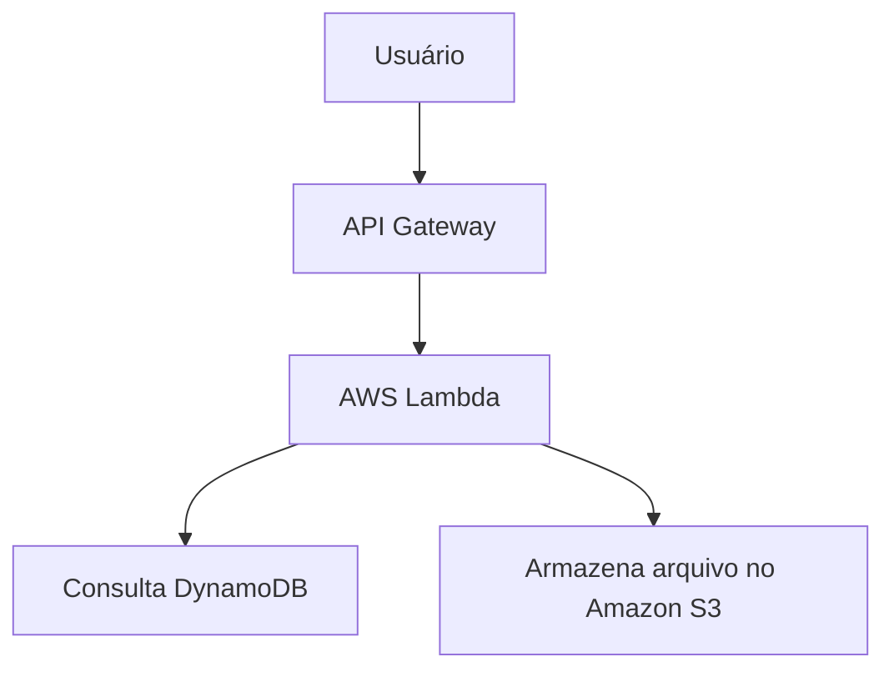

# Lambda

O **AWS Lambda** é um serviço de computação **serverless** da AWS que permite executar código sem a necessidade de provisionar ou gerenciar servidores. Com o Lambda, você desenvolve apenas a lógica da aplicação, enquanto a AWS cuida da infraestrutura, da escalabilidade e da disponibilidade.

As funções Lambda são executadas em resposta a **eventos**, como uma requisição para uma API, o upload de um arquivo ou a publicação de uma mensagem em uma fila.

## Como funciona

O funcionamento do AWS Lambda pode ser resumido em quatro etapas:

1. O desenvolvedor cria uma função em uma linguagem suportada (como Python, Java, Node.js ou C#).
2. A função é implantada no AWS Lambda.
3. Um evento dispara a execução da função.
4. O Lambda executa o código e retorna o resultado.

Exemplo de fluxo:

## Principais características

* **Serverless:** não é necessário administrar servidores.
* **Escalabilidade automática:** o serviço aumenta ou reduz automaticamente o número de execuções conforme a demanda.
* **Execução sob demanda:** a função é executada apenas quando ocorre um evento.
* **Pagamento por uso:** a cobrança é baseada no número de execuções e no tempo de processamento.
* **Alta disponibilidade:** a AWS distribui automaticamente as execuções em sua infraestrutura.

## Fontes de eventos

O AWS Lambda pode ser acionado por diversos serviços da AWS, entre eles:

* Amazon API Gateway – chamadas para APIs REST ou HTTP.
* Amazon S3 – upload, alteração ou exclusão de arquivos.
* Amazon DynamoDB – alterações em tabelas por meio do DynamoDB Streams.
* Amazon EventBridge – eventos de aplicações e serviços.
* Amazon SQS – processamento de mensagens em filas.
* Amazon SNS – notificações e mensagens publicadas em tópicos.

## Linguagens suportadas

O AWS Lambda oferece suporte a diversas linguagens, incluindo:

* Python
* Java
* Node.js
* C#
* Go
* Ruby
* PowerShell

Também é possível utilizar outras linguagens por meio de imagens de contêiner ou runtimes personalizados.

## Casos de uso

O AWS Lambda é amplamente utilizado para:

* Desenvolvimento de APIs.
* Processamento de arquivos enviados ao Amazon S3.
* Automação de tarefas administrativas.
* Processamento de eventos em tempo real.
* Backends para aplicações web e móveis.
* Integração entre sistemas.
* Arquiteturas de microsserviços.

## Vantagens

* Não há necessidade de gerenciar servidores.
* Escalabilidade automática.
* Pagamento apenas pelo tempo de execução.
* Integração com diversos serviços da AWS.
* Ideal para aplicações orientadas a eventos.

## Desvantagens

* **Cold start:** após um período de inatividade, a primeira execução pode apresentar um pequeno atraso.
* Tempo máximo de execução por invocação.
* Pode não ser a melhor opção para aplicações que exigem processamento contínuo ou de longa duração.

## Exemplo prático

Imagine uma aplicação de compartilhamento de fotos:

1. O usuário envia uma imagem para um bucket no **Amazon S3**.
2. O upload gera um evento.
3. O evento aciona uma função **AWS Lambda**.
4. A função redimensiona a imagem.
5. A imagem processada é salva em outro bucket do Amazon S3.

Esse fluxo ocorre automaticamente, sem necessidade de manter um servidor em execução.

## Resumo

O **AWS Lambda** é um serviço de computação serverless que executa código em resposta a eventos. Ele elimina a necessidade de gerenciar servidores, oferece escalabilidade automática e cobrança baseada no consumo, sendo uma excelente opção para APIs, automações, processamento de arquivos e aplicações orientadas a eventos. É um dos principais componentes para a construção de arquiteturas modernas e serverless na AWS.
