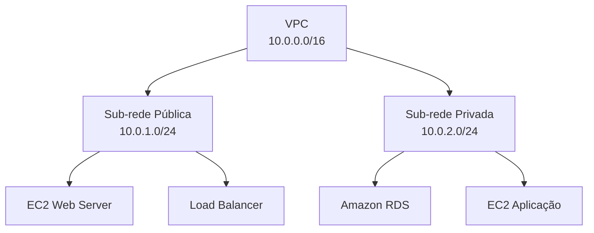
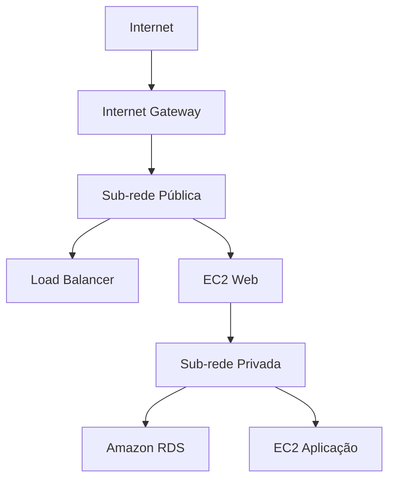

# VPC

O **Amazon VPC (Amazon Virtual Private Cloud)** é um serviço da AWS que permite criar uma **rede virtual privada** na nuvem. Com ele, você define como os recursos da sua aplicação, como servidores, bancos de dados e serviços, se comunicam entre si e com a internet.

A VPC oferece controle sobre a configuração da rede, incluindo endereçamento IP, sub-redes, tabelas de rotas, gateways e regras de segurança.

## Como funciona

Ao criar uma VPC, você define um bloco de endereços IP (CIDR), por exemplo:

```text
VPC
CIDR: 10.0.0.0/16
```

Dentro dessa VPC, você cria **sub-redes (subnets)** para organizar os recursos.

Exemplo:




Nesse exemplo:

* A **sub-rede pública** possui acesso à internet.
* A **sub-rede privada** é acessível apenas internamente, aumentando a segurança.

## Principais componentes

### 1. VPC

É a rede virtual que contém todos os recursos da aplicação.

### 2. Subnets

Dividem a VPC em redes menores.

Podem ser:

* **Públicas:** possuem acesso à internet.
* **Privadas:** não possuem acesso direto à internet.

### 3. Internet Gateway (IGW)

Permite que recursos em sub-redes públicas se comuniquem com a internet.

### 4. NAT Gateway

Permite que instâncias em sub-redes privadas acessem a internet para atualizações e downloads, sem aceitar conexões iniciadas da internet.

### 5. Route Tables

Definem para onde o tráfego de rede será direcionado.

### 6. Security Groups

Funcionam como um **firewall de instância**, controlando o tráfego de entrada e saída de recursos como o Amazon EC2.

Exemplo:

* Permitir HTTP (porta 80)
* Permitir HTTPS (porta 443)
* Permitir SSH (porta 22) apenas para administradores

### 7. Network ACL (NACL)

Firewall aplicado no nível da sub-rede, adicionando uma camada extra de segurança.

## Casos de uso

A Amazon VPC é utilizada para:

* Isolar aplicações na nuvem.
* Criar ambientes de desenvolvimento, homologação e produção.
* Hospedar aplicações web.
* Executar bancos de dados em redes privadas.
* Integrar ambientes locais (on-premises) com a AWS.
* Construir arquiteturas seguras e escaláveis.

## Exemplo de arquitetura




Nesse cenário:

* Os usuários acessam a aplicação pela internet.
* O servidor web recebe as requisições.
* O banco de dados permanece protegido em uma sub-rede privada.

## Vantagens

* Isolamento da infraestrutura.
* Alto nível de segurança.
* Controle total da rede.
* Integração com outros serviços da AWS.
* Suporte a arquiteturas escaláveis e de alta disponibilidade.

## Desvantagens

* Exige conhecimento de redes (endereçamento IP, roteamento e segurança).
* Configurações incorretas podem impedir a comunicação entre os recursos.
* Ambientes grandes podem se tornar complexos de administrar.

## Resumo

A **Amazon VPC** é o serviço de rede da AWS que permite criar uma infraestrutura virtual segura e isolada. Ela oferece controle sobre endereçamento IP, sub-redes, roteamento e regras de segurança, sendo a base para hospedar aplicações e serviços na nuvem. Ao utilizar a VPC, é possível separar recursos públicos e privados, proteger bancos de dados e criar arquiteturas escaláveis e altamente seguras.
