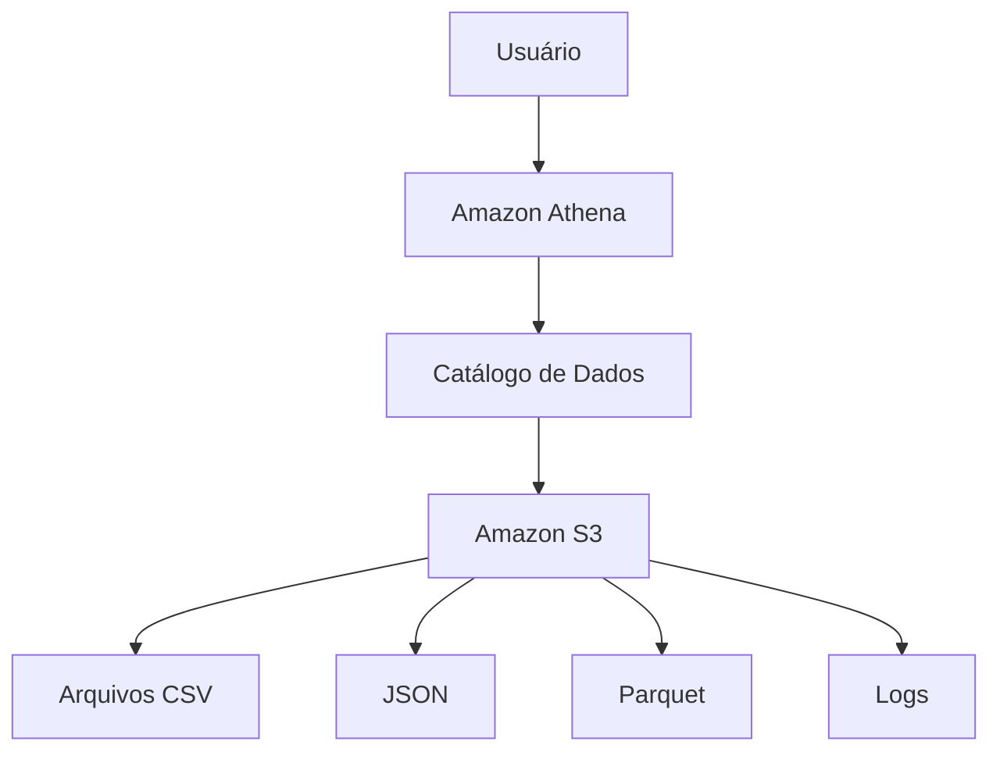
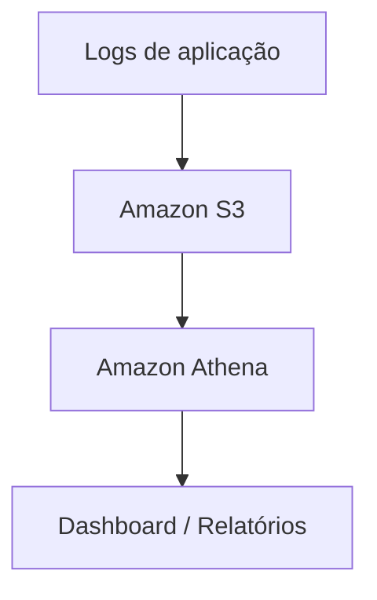

# Athena

O **Amazon Athena** é um serviço de **consulta de dados (query) serverless** que permite analisar dados armazenados no **Amazon S3** usando **SQL**, sem a necessidade de criar ou administrar servidores, clusters ou bancos de dados.

## Como funciona

O Athena utiliza o conceito de **data lake**, onde os dados ficam armazenados no S3 e são consultados diretamente quando necessário.

Fluxo básico:




O usuário executa uma consulta SQL no Athena, o serviço lê os arquivos armazenados no S3 e retorna os resultados.

## Principais características

* **Serverless:** não há servidores para provisionar ou gerenciar.
* **Consultas SQL:** utiliza linguagem SQL para análise dos dados.
* **Integração nativa com S3:** consulta dados diretamente no armazenamento de objetos.
* **Pagamento por uso:** normalmente baseado na quantidade de dados processados pelas consultas.
* **Escalabilidade automática:** consegue analisar grandes volumes de dados.

## Componentes importantes

### 1. Data Source (Fonte de dados)

Local onde os dados estão armazenados, geralmente:

* Amazon S3
* Bancos de dados externos
* Outras fontes integradas

### 2. AWS Glue Data Catalog

O Athena utiliza o **AWS Glue Data Catalog** para armazenar informações sobre os dados, como:

* Nome das tabelas.
* Colunas.
* Tipos de dados.
* Localização dos arquivos no S3.

### 3. Engine SQL

O Athena utiliza mecanismos baseados em SQL para executar consultas distribuídas sobre grandes volumes de dados.

## Exemplo de consulta

Imagine arquivos de vendas armazenados no S3:

```text
s3://empresa-dados/vendas/
    ├── vendas_2025.csv
    ├── vendas_2026.csv
```

Uma consulta no Athena poderia ser:

```sql
SELECT 
    produto,
    SUM(valor)
FROM vendas
GROUP BY produto;
```

Resultado:

```text
Produto       Total
Notebook      50000
Celular       35000
Monitor       15000
```

## Casos de uso

O Amazon Athena é utilizado para:

* Análise de grandes volumes de dados.
* Data lakes.
* Relatórios e dashboards.
* Análise de logs de aplicações.
* Auditoria e segurança.
* Business Intelligence (BI).

Exemplos de integração:




## Vantagens

- Não precisa administrar infraestrutura.
- Integração direta com S3.
- Usa SQL, uma linguagem conhecida por analistas.
- Bom para análises exploratórias.
- Escala para grandes volumes de dados.

## Desvantagens

- Não é indicado para aplicações transacionais (como sistemas de cadastro em tempo real).
- Consultas podem ficar caras se os dados não estiverem bem organizados.
- Depende de uma boa organização do Data Lake.

## Diferença entre Athena e RDS

| Amazon Athena          | Amazon RDS                          |
| ---------------------- | ----------------------------------- |
| Analisa dados no S3    | Banco de dados operacional          |
| Serverless             | Banco gerenciado                    |
| Ideal para análise     | Ideal para aplicações transacionais |
| Usa SQL sobre arquivos | Usa tabelas relacionais             |
| Data Lake              | Sistemas OLTP                       |

## Resumo

O **Amazon Athena** é um serviço AWS de análise de dados **serverless** que permite executar consultas SQL diretamente sobre dados armazenados no **Amazon S3**. Ele é muito utilizado em arquiteturas modernas de **Data Lake**, análise de grandes volumes de informações, relatórios e processamento de logs, sem a necessidade de gerenciar servidores ou infraestrutura.
