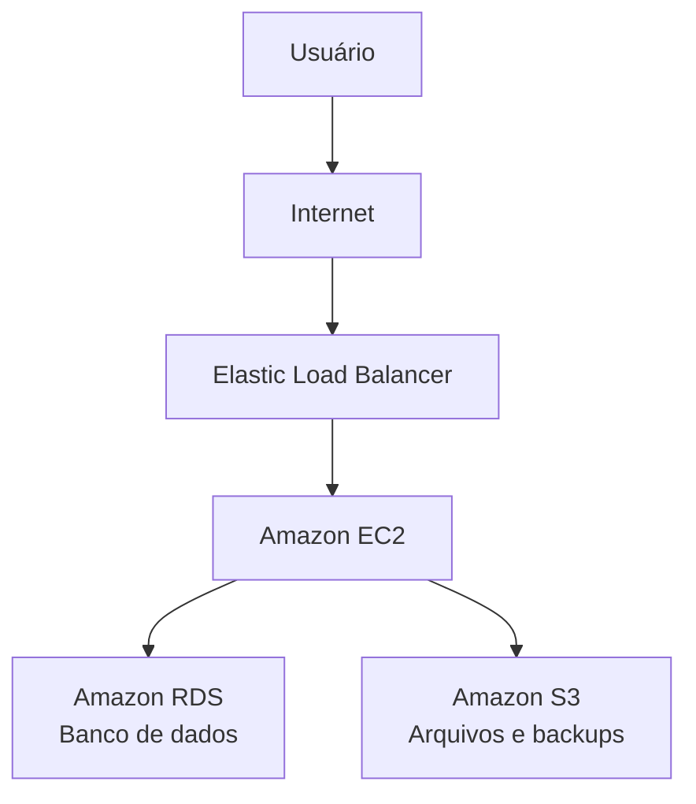

# EC2

O **Amazon EC2 (Amazon Elastic Compute Cloud)** é um dos principais serviços da AWS. Ele permite criar e executar **servidores virtuais na nuvem**, chamados de **instâncias**, que podem hospedar aplicações, sites, bancos de dados e diversos outros serviços.

## Como funciona

No Amazon EC2, você escolhe a configuração do servidor conforme a necessidade da aplicação, como:

* Sistema operacional (Linux ou Windows).
* Quantidade de CPU (vCPUs).
* Memória RAM.
* Tipo e capacidade de armazenamento.
* Configuração de rede e segurança.

Após a criação, a instância fica disponível para acesso remoto (SSH no Linux ou RDP no Windows), permitindo instalar softwares e gerenciar o servidor como se fosse uma máquina física.

## Principais características

* **Escalabilidade:** é possível aumentar ou reduzir os recursos da instância conforme a demanda.
* **Alta disponibilidade:** as instâncias podem ser distribuídas em diferentes zonas de disponibilidade para aumentar a resiliência.
* **Segurança:** integração com o AWS IAM, grupos de segurança (Security Groups) e redes privadas por meio do Amazon VPC.
* **Flexibilidade:** suporta diferentes sistemas operacionais e tipos de hardware.

## Componentes importantes

* **Instância:** servidor virtual em execução.
* **AMI (Amazon Machine Image):** imagem que contém o sistema operacional e softwares necessários para iniciar uma instância.
* **Tipo de instância:** define CPU, memória e desempenho (por exemplo, uso geral, computação otimizada ou memória otimizada).
* **Volume EBS:** armazenamento persistente que permanece disponível mesmo após a parada da instância, dependendo da configuração.
* **Security Group:** firewall virtual que controla o tráfego de entrada e saída.

## Casos de uso

O Amazon EC2 é utilizado para:

* Hospedar sites e aplicações web.
* Executar APIs e microsserviços.
* Ambientes de desenvolvimento e testes.
* Processamento de dados.
* Aplicações corporativas.
* Servidores de jogos e aplicações de alto desempenho.

## Exemplo de arquitetura

## Vantagens

* Provisionamento de servidores em poucos minutos.
* Pagamento conforme o uso.
* Grande variedade de configurações de instâncias.
* Facilidade para aumentar ou reduzir a capacidade.
* Integração com diversos serviços da AWS.

## Desvantagens

* É responsabilidade do usuário administrar o sistema operacional, instalar atualizações e configurar a segurança da instância.
* Custos podem aumentar se os recursos não forem dimensionados adequadamente.
* Requer conhecimentos de administração de servidores.

### Resumo

O **Amazon EC2** é um serviço de infraestrutura em nuvem (IaaS) que fornece servidores virtuais escaláveis. Ele oferece flexibilidade para executar praticamente qualquer tipo de aplicação, permitindo escolher a configuração ideal de CPU, memória, armazenamento e sistema operacional, enquanto a AWS gerencia a infraestrutura física subjacente. É uma das soluções mais utilizadas para hospedar aplicações e serviços na nuvem.
