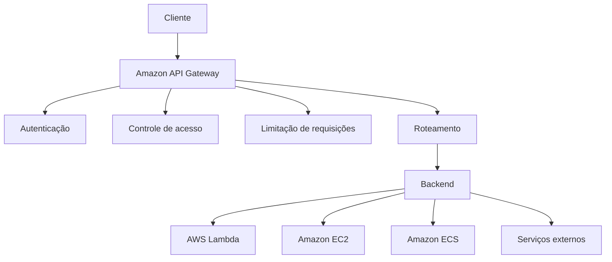
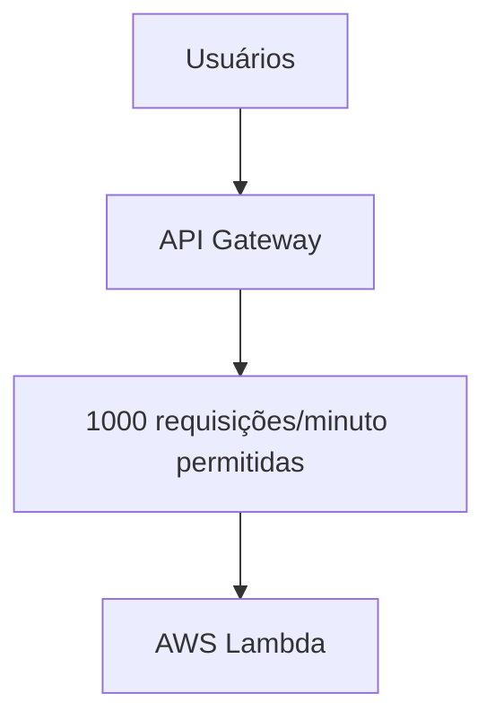
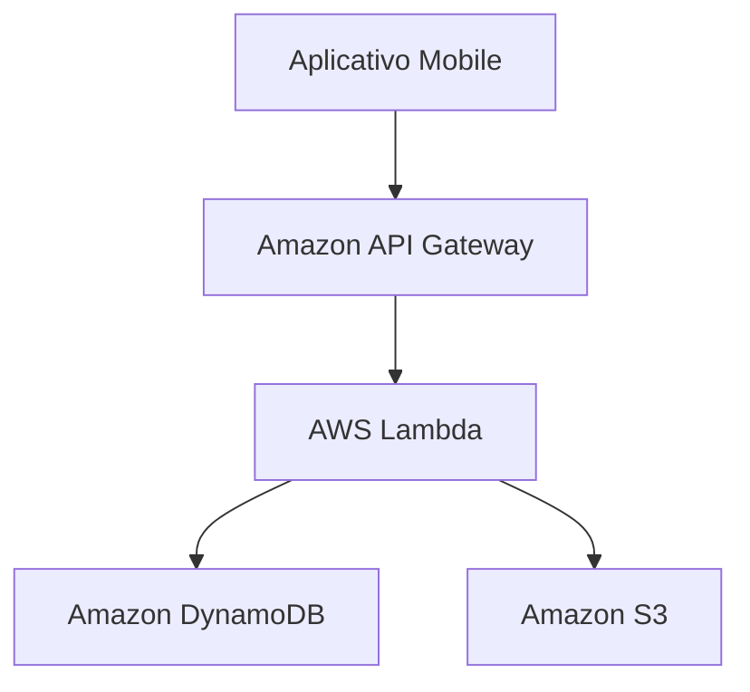

# Amazon API Gateway

O **Amazon API Gateway** é um serviço totalmente gerenciado da AWS utilizado para **criar, publicar, proteger, monitorar e gerenciar APIs**. Ele funciona como uma porta de entrada (gateway) entre clientes e serviços de backend, como funções **AWS Lambda**, aplicações em **Amazon EC2**, containers e outros sistemas.

Ele é muito utilizado em arquiteturas **serverless**, onde uma API recebe requisições dos usuários e encaminha essas chamadas para serviços responsáveis pelo processamento.

## Como funciona

O API Gateway recebe uma solicitação do cliente, aplica regras de segurança e gerenciamento, encaminha para o serviço de backend e devolve a resposta.

Fluxo básico:




## Tipos de APIs suportadas

### 1. HTTP APIs

São APIs mais simples e de menor custo, indicadas para aplicações modernas que precisam de alta performance.

Uso comum:

* Aplicações web.
* Aplicativos móveis.
* Microsserviços.

### 2. REST APIs

Oferecem recursos mais avançados de gerenciamento.

Possuem suporte a:

* Transformação de requisições e respostas.
* Controle detalhado de autorização.
* Cache integrado.
* Validação de parâmetros.

### 3. WebSocket APIs

Permitem comunicação bidirecional em tempo real.

Exemplos:

* Chats.
* Jogos online.
* Aplicações colaborativas.

## Principais componentes

### 1. API

É a interface criada para receber chamadas dos clientes.

Exemplo:

```text
GET /clientes
POST /pedidos
DELETE /produtos/{id}
```

### 2. Recursos e métodos

Definem os caminhos e operações disponíveis.

Exemplo:

```text
/usuarios
   ├── GET    → listar usuários
   ├── POST   → criar usuário
   └── DELETE → remover usuário
```

### 3. Integrações

Definem para onde as requisições serão enviadas.

Pode integrar com:

* AWS Lambda.
* Amazon EC2.
* Serviços HTTP externos.
* Outros serviços AWS.

### 4. Estágios (Stages)

Permitem separar ambientes:

* Desenvolvimento.
* Testes.
* Produção.

Exemplo:

```text
API
 ├── Dev
 ├── Homologação
 └── Produção
```

## Recursos de segurança

O API Gateway oferece mecanismos para proteger APIs:

* Integração com o **AWS IAM**.
* Autenticação via tokens.
* Integração com provedores de identidade.
* Controle de acesso por políticas.
* Integração com o **AWS WAF**.

## Controle de tráfego

O serviço permite controlar o consumo da API através de:

* **Throttling:** limita a quantidade de requisições.
* **Rate limiting:** controla chamadas por período.
* **Cache:** reduz chamadas ao backend armazenando respostas temporariamente.

Exemplo:




## Monitoramento

O API Gateway integra-se com:

* **Amazon CloudWatch** para métricas e logs.
* Rastreamento de erros.
* Monitoramento de latência.
* Análise de requisições.

Métricas comuns:

* Quantidade de chamadas.
* Tempo de resposta.
* Erros HTTP 4xx e 5xx.
* Taxa de falhas.

## Casos de uso

O Amazon API Gateway é utilizado para:

* Criar APIs REST para aplicações web e mobile.
* Construir backends serverless.
* Expor serviços internos de empresas.
* Criar microsserviços.
* Integrar sistemas diferentes.
* Criar APIs para dispositivos IoT.

## Exemplo de arquitetura serverless




Exemplo:

1. O aplicativo envia uma solicitação para consultar um usuário.
2. O API Gateway recebe a chamada.
3. A função Lambda processa a lógica.
4. O DynamoDB retorna os dados.
5. A resposta volta ao aplicativo.

## Vantagens

* Não exige gerenciamento de servidores.
* Escala automaticamente.
* Integração nativa com serviços AWS.
* Recursos de segurança incorporados.
* Facilita criação e gerenciamento de APIs.
* Ideal para arquiteturas serverless.

## Desvantagens

* Pode gerar custos elevados em APIs com grande volume de chamadas.
* Configurações avançadas podem ser complexas.
* Pode criar dependência do ecossistema AWS.

## Resumo

O **Amazon API Gateway** é o serviço da AWS responsável por criar e gerenciar APIs de forma segura e escalável. Ele atua como uma camada intermediária entre clientes e aplicações, controlando autenticação, tráfego, roteamento e monitoramento. É um componente fundamental em arquiteturas modernas, principalmente em soluções **serverless**, integrando-se diretamente com serviços como **AWS Lambda**, **DynamoDB**, **S3** e outros recursos da AWS.
