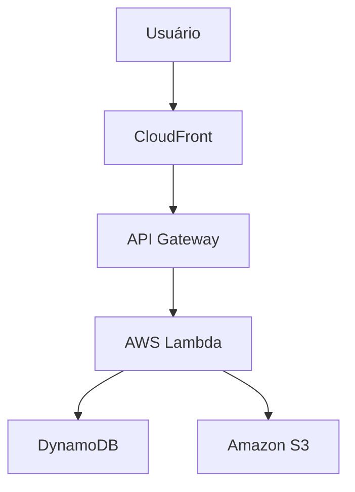

# Quem trabalha com Qualidade de Software precisa saber AWS ?

Dependendo da área e do nível de atuação em **Qualidade de Software (QA)**, mas atualmente **ter conhecimentos de AWS é um diferencial importante**, especialmente para quem trabalha com sistemas modernos, aplicações web, APIs, microsserviços e ambientes de nuvem.

Um profissional de QA **não precisa dominar AWS como um arquiteto de soluções ou administrador de infraestrutura**, mas entender os principais conceitos ajuda bastante a testar melhor as aplicações.

## Por que QA deve conhecer AWS?

### 1. Entender o ambiente onde a aplicação roda

Muitos sistemas hoje são hospedados na nuvem. O QA precisa saber onde a aplicação está executando e como os componentes se comunicam.

Exemplo:

Conhecendo essa arquitetura, o QA consegue identificar onde podem ocorrer problemas:

* Erros na API.
* Falhas de autenticação.
* Problemas de armazenamento.
* Lentidão no processamento.
* Falhas de integração.

---

## Conhecimentos AWS importantes para QA

### Amazon EC2

Saber:

* O que é uma máquina virtual.
* Como aplicações são hospedadas.
* Diferença entre ambiente de teste e produção.

Útil para:

* Testes de infraestrutura.
* Validação de deploys.
* Análise de problemas de ambiente.

---

### Amazon S3

Saber:

* Como arquivos são armazenados.
* Permissões de acesso.
* Upload e download de objetos.

Útil para testar:

* Upload de documentos.
* Imagens.
* Backups.
* Integrações com arquivos.

---

### Amazon RDS e Amazon DynamoDB

Saber:

* Diferença entre banco relacional e NoSQL.
* Como a aplicação consulta dados.
* Como validar informações persistidas.

Útil para:

* Testes de dados.
* Testes de API.
* Testes de integração.

---

### AWS Lambda

Saber:

* O conceito de funções serverless.
* Execução por eventos.
* Limitações de tempo e processamento.

Útil para testar:

* Processamentos automáticos.
* Integrações.
* Fluxos orientados a eventos.

---

### Amazon API Gateway

Muito relevante para QA.

Conhecer:

* Endpoints.
* Métodos HTTP (GET, POST, PUT, DELETE).
* Códigos de resposta (200, 400, 401, 404, 500).
* Autenticação.

Útil para:

* Testes de API com ferramentas como Postman ou automação.

---

### Amazon CloudWatch

Ajuda o QA a:

* Consultar logs.
* Identificar erros.
* Analisar comportamento da aplicação.
* Investigar falhas em testes.

Exemplo:

> Um teste automatizado falhou. O QA verifica o log do Lambda no CloudWatch e encontra a causa do erro.

---

### AWS IAM

Importante para entender:

* Usuários.
* Permissões.
* Controle de acesso.

Útil para testar:

* Login.
* Autorização.
* Perfis de usuário.

---

# O que um QA deveria saber de AWS?

### Nível básico (recomendado para todos)

- Conceito de nuvem
- Regiões e zonas de disponibilidade
- EC2, S3, Lambda, RDS
- API Gateway
- CloudWatch
- IAM
- Noções de arquitetura cloud

### Nível intermediário (QA mais avançado)

- Testes em APIs hospedadas na AWS
- Leitura de logs
- Testes de performance em ambientes cloud
- Integração contínua (CI/CD)
- Containers com Amazon Elastic Container Service ou Amazon Elastic Kubernetes Service
- Automação de infraestrutura

### Nível avançado (QA Lead / SDET)

- Arquitetura distribuída
- Observabilidade
- Segurança em cloud
- Estratégias de testes para microsserviços
- Pipelines de entrega contínua

---

## Certificação AWS ajuda QA?

Pode ajudar. Uma boa porta de entrada é:

* AWS Certified Cloud Practitioner → visão geral da AWS.
* AWS Certified Solutions Architect - Associate → mais voltada para arquitetura.

---

## Resumo

Um profissional de **Qualidade de Software não precisa ser especialista em AWS**, mas conhecer os principais serviços e conceitos de nuvem aumenta sua capacidade de:

* Criar melhores estratégias de teste.
* Investigar falhas.
* Trabalhar melhor com desenvolvedores e DevOps.
* Testar APIs, microsserviços e aplicações modernas.

Para um QA que quer crescer para **QA Automation, SDET, QA Lead ou trabalhar em empresas com cultura DevOps**, AWS é um conhecimento cada vez mais valorizado.
