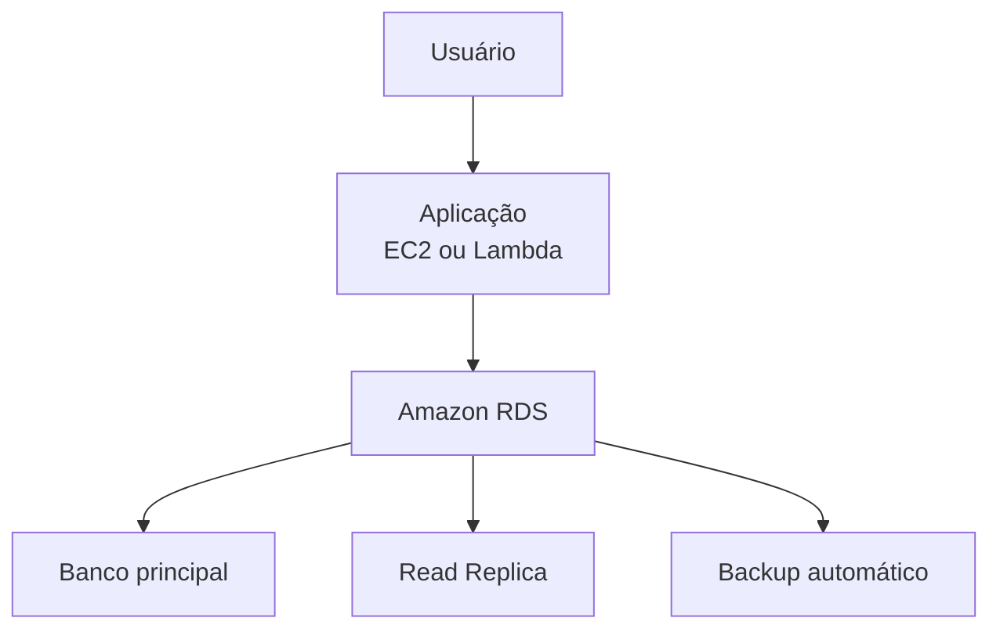

# RDS

O **Amazon RDS (Amazon Relational Database Service)** é um serviço de banco de dados relacional gerenciado da AWS. Ele facilita a criação, operação e escalabilidade de bancos de dados na nuvem, eliminando grande parte das tarefas de administração, como instalação, atualizações, backups e monitoramento.

## Como funciona

Com o Amazon RDS, você cria uma instância de banco de dados e escolhe o mecanismo (engine), a capacidade de processamento, a memória e o armazenamento. A AWS gerencia a infraestrutura, enquanto você se concentra no desenvolvimento da aplicação e na administração dos dados.

## Bancos de dados suportados

O Amazon RDS oferece suporte a diversos mecanismos de banco de dados relacionais, incluindo:

* MySQL
* PostgreSQL
* MariaDB
* Oracle Database
* Microsoft SQL Server

## Principais características

* **Gerenciamento automático:** a AWS cuida da instalação, atualizações e manutenção do banco de dados.
* **Backups automáticos:** permite restaurar o banco para um ponto específico no tempo.
* **Alta disponibilidade:** com a opção **Multi-AZ**, uma cópia do banco é mantida em outra zona de disponibilidade para aumentar a resiliência.
* **Escalabilidade:** é possível aumentar recursos como CPU, memória e armazenamento conforme a demanda.
* **Segurança:** integração com o AWS IAM, criptografia de dados e isolamento por meio do Amazon VPC.

## Componentes importantes

* **DB Instance:** servidor onde o banco de dados é executado.
* **Storage:** espaço utilizado para armazenar os dados.
* **Read Replica:** réplica de leitura para distribuir consultas e melhorar o desempenho.
* **Multi-AZ:** implantação com redundância para alta disponibilidade.
* **Snapshots:** cópias de segurança que podem ser restauradas quando necessário.

## Casos de uso

O Amazon RDS é indicado para:

* Sistemas de gestão empresarial (ERP).
* Sistemas de relacionamento com clientes (CRM).
* Aplicações web e móveis.
* Plataformas de e-commerce.
* Sistemas financeiros.
* Aplicações que utilizam bancos de dados relacionais.

## Exemplo de arquitetura

## Vantagens

* Reduz o trabalho de administração do banco de dados.
* Backups e recuperação automáticos.
* Escalabilidade de recursos.
* Alta disponibilidade com Multi-AZ.
* Integração com outros serviços da AWS.

## Desvantagens

* Menor controle sobre a infraestrutura em comparação com um banco instalado diretamente em uma máquina virtual.
* Alguns recursos avançados podem variar conforme o mecanismo de banco escolhido.
* Custos podem aumentar ao utilizar recursos como Multi-AZ, armazenamento adicional e réplicas de leitura.

## Resumo

O **Amazon RDS** é um serviço gerenciado de banco de dados relacional que simplifica a administração de bancos de dados na nuvem. Ele oferece recursos como backups automáticos, alta disponibilidade, escalabilidade e segurança, permitindo que desenvolvedores e empresas foquem na aplicação enquanto a AWS gerencia a infraestrutura do banco de dados.
