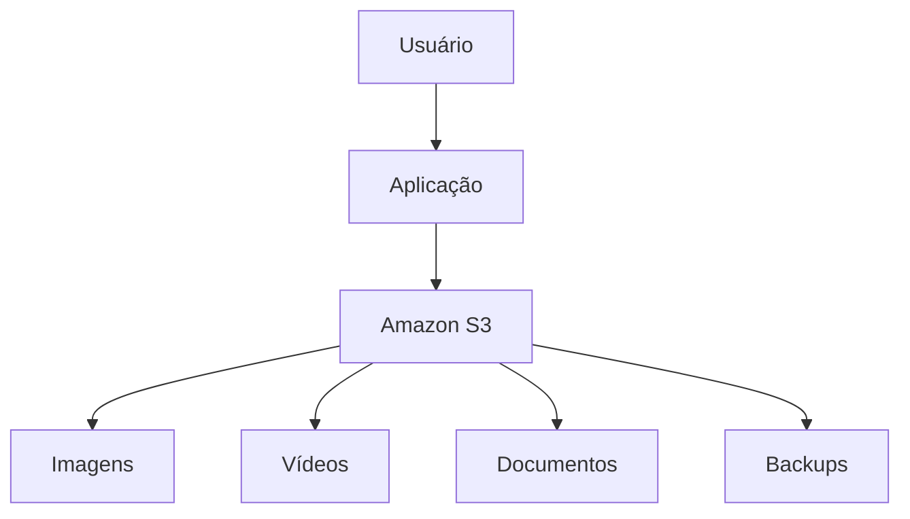

# S3

O **Amazon S3 (Amazon Simple Storage Service)** é um serviço de armazenamento de objetos da AWS. Ele permite armazenar e recuperar qualquer quantidade de dados pela internet, com alta durabilidade, escalabilidade e disponibilidade.

O Amazon S3 é amplamente utilizado para armazenar arquivos como imagens, vídeos, documentos, backups, logs, arquivos estáticos de sites e dados para aplicações.

## Como funciona

No Amazon S3, os arquivos são armazenados como **objetos**, que ficam organizados dentro de **buckets** (baldes).

A estrutura é composta por:

* **Bucket:** contêiner onde os arquivos são armazenados.
* **Objeto:** o arquivo propriamente dito (imagem, vídeo, PDF, etc.).
* **Chave (Key):** identificador único do objeto dentro do bucket.

Exemplo:

```text
Bucket: empresa-documentos

Objetos:
- contratos/cliente1.pdf
- imagens/logo.png
- backups/backup-01.zip
```

## Principais características

* **Alta durabilidade:** projetado para armazenar dados com alta confiabilidade.
* **Escalabilidade automática:** suporta desde poucos arquivos até bilhões de objetos.
* **Alta disponibilidade:** permite acesso aos dados quando necessário.
* **Segurança:** oferece criptografia, controle de acesso e integração com o AWS IAM.
* **Versionamento:** mantém versões anteriores de um arquivo, facilitando a recuperação em caso de alterações ou exclusões.

## Classes de armazenamento

O Amazon S3 oferece diferentes classes para equilibrar custo e frequência de acesso:

* **S3 Standard:** para dados acessados com frequência.
* **S3 Intelligent-Tiering:** move automaticamente os dados entre camadas conforme o padrão de uso.
* **S3 Standard-Infrequent Access (Standard-IA):** para dados acessados ocasionalmente.
* **S3 One Zone-IA:** armazena dados em uma única zona de disponibilidade, com menor custo.
* **S3 Glacier Instant Retrieval:** para arquivamento com recuperação rápida.
* **S3 Glacier Flexible Retrieval:** para arquivamento de longo prazo.
* **S3 Glacier Deep Archive:** para retenção de dados por muitos anos, com menor custo e recuperação mais lenta.

## Casos de uso

O Amazon S3 é utilizado para:

* Armazenamento de imagens e vídeos.
* Hospedagem de sites estáticos.
* Backup e recuperação de dados.
* Armazenamento de documentos.
* Data lakes e análise de dados.
* Distribuição de conteúdo em conjunto com o Amazon CloudFront.

## Exemplo de arquitetura




## Vantagens

* Armazenamento praticamente ilimitado.
* Alta durabilidade e disponibilidade.
* Pagamento conforme o uso.
* Escalabilidade automática.
* Integração com diversos serviços da AWS, como AWS Lambda, Amazon CloudFront e Amazon Athena.

## Desvantagens

* Não é um sistema de arquivos tradicional nem um disco para instalação de sistemas operacionais.
* Custos podem aumentar com grandes volumes de transferência de dados e acessos frequentes.
* O desempenho pode variar dependendo do padrão de acesso e da arquitetura da aplicação.

## Resumo

O **Amazon S3** é um serviço de armazenamento de objetos altamente escalável e seguro, ideal para guardar arquivos de qualquer tamanho. Ele é amplamente utilizado em aplicações modernas para armazenamento de conteúdo, backups, hospedagem de sites estáticos e análise de dados, oferecendo alta durabilidade, diversas opções de armazenamento e pagamento baseado no consumo.
