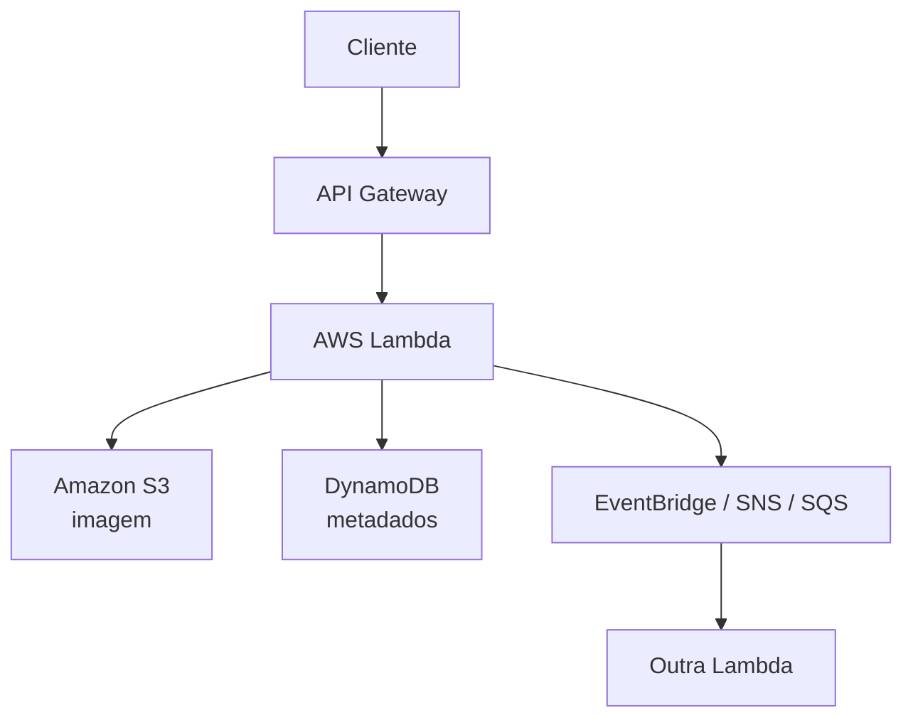

A **arquitetura serverless na AWS** é um modelo em que você desenvolve e executa aplicações sem precisar gerenciar servidores. A infraestrutura é provisionada, escalada e mantida automaticamente pela AWS, enquanto você foca apenas no código e na lógica de negócio.

### Principais características

* **Sem gerenciamento de servidores:** não é necessário configurar ou administrar máquinas virtuais.
* **Escalabilidade automática:** os recursos aumentam ou diminuem conforme a demanda.
* **Pagamento por uso:** você paga apenas pelas execuções e recursos efetivamente consumidos.
* **Alta disponibilidade:** os serviços já são projetados para operar com redundância.

### Serviços mais utilizados

* Amazon Web Services **AWS Lambda**: executa funções em resposta a eventos, sem necessidade de manter servidores ativos.
* Amazon API Gateway: cria APIs REST ou HTTP para expor funcionalidades das aplicações.
* Amazon DynamoDB: banco de dados NoSQL totalmente gerenciado.
* Amazon S3: armazenamento de arquivos, imagens, vídeos e documentos.
* Amazon EventBridge: integra serviços e aplicações por meio de eventos.
* Amazon SQS: filas de mensagens para comunicação assíncrona.
* Amazon SNS: envio de notificações e publicação/assinatura de mensagens.
* AWS Step Functions: coordena fluxos de trabalho entre múltiplas funções e serviços.

### Exemplo de arquitetura

Imagine um sistema de upload de imagens:

1. O usuário envia uma imagem para uma API.
2. O **API Gateway** recebe a requisição.
3. O **AWS Lambda** valida e processa a imagem.
4. A imagem é armazenada no **Amazon S3**.
5. Os metadados são gravados no **Amazon DynamoDB**.
6. Um evento no **Amazon EventBridge** ou **Amazon S3** dispara outra função Lambda para gerar miniaturas ou enviar notificações.

Fluxo simplificado:

### Vantagens

* Redução de custos em aplicações com uso variável.
* Escalabilidade automática.
* Menor esforço operacional.
* Implantações rápidas.
* Integração nativa entre serviços da AWS.

### Desvantagens

* **Cold start:** algumas funções podem ter um pequeno atraso na primeira execução após um período de inatividade.
* Maior dependência do ecossistema da AWS (vendor lock-in).
* Depuração e monitoramento distribuídos podem ser mais complexos.
* Limitações de tempo de execução e recursos para determinadas funções.

### Casos de uso

* APIs REST e HTTP.
* Processamento de arquivos e imagens.
* Automação de tarefas.
* Backends para aplicações web e mobile.
* Processamento de eventos em tempo real.
* Integração entre sistemas.
* ETL e pipelines de dados.

Em resumo, uma arquitetura serverless na AWS combina serviços gerenciados, como **AWS Lambda**, **Amazon API Gateway**, **Amazon S3** e **Amazon DynamoDB**, para criar aplicações escaláveis, resilientes e com cobrança baseada no consumo, eliminando a necessidade de administrar servidores diretamente.
